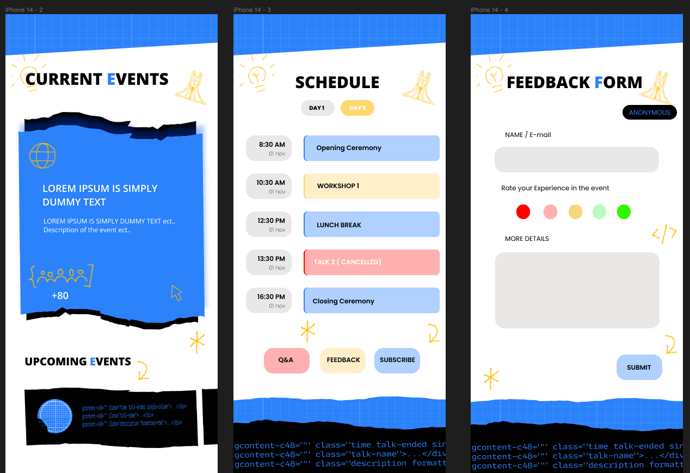

## Create UI Screens
### 1. Description
If you’re a mobile developer, or not :eyes: the first thing that you should notice in order to build your app; is to care about your UI. Therefore, your screens app will be more attractives and get the satisfaction of your users.

By using **Flutter Framework**, and as shown in the pictures below, you will work in this challenge on some screens of “GDG Algiers Events” App. Mainly, you should implement those three screens:

## Expectations:
* Develop a mobile application that includes the 3 screens.
* Make interaction and navigation between the screens.
* Create at least 3 events with dynamic data  and pass it between screens.
* Notice that you are not allowed to use any third party package to develop the screens.

## Assets:
the are available via this link 