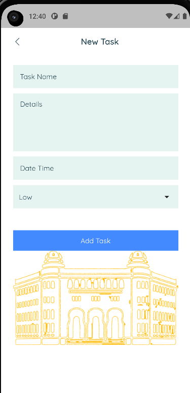
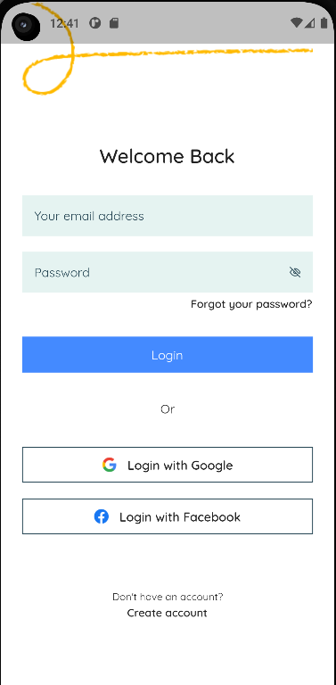
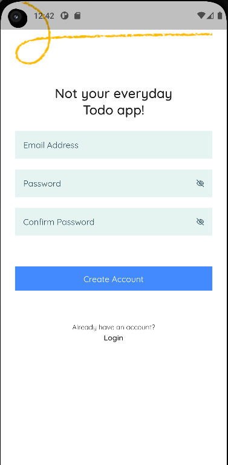

##  FixIt
### Intrduction
Mobile development is not about adding features and making ui components, a developer may spend in general up to 70% of his time debugging and trying to solve some bugs, these bugs can be categorized into three main types, Compile time bugs, which may be presents in case of a compile error; Executin time bugs, which are more related to the execution of the mobile application, where the application crash because of it; Finally, the logical errors, which are the hardest, are more concerned with logical errors when designing or writing the mobile application. 

### Description
We have made a TodoList application, and we wanted to push it to the stores so that our friends can use it, but our recent developer just left us, leaving behind him an applicatioon filled with errors, can you help us fix these errors and recover the healthiest state of our application ?
Here are some screenshots about our application that worked in a demo, we want to have the application completly working 

You can find below the screenshots that we took of the working version of our application: 

### To pass this challenge:
- [ ]  Fix all the compilation errors 
- [ ]  Find and fix the execution errors
- [ ]  Find and Fix the logical execution errors

We would conside the challenge as solved once the application is working fine, please test all the cases, if we test the application and find that it crashes or it doesn't work like we want, the submission would be refused.
