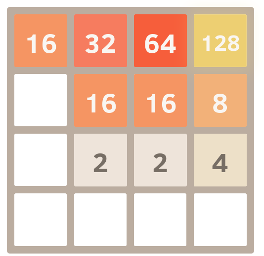

##  2048 Game
### motivation
For most developers, Flutter is an app framework. But there’s also a growing community around casual game development, taking advantage of the hardware-accelerated graphics support provided by Flutter.Over the past year, thousands of Flutter games have been published. Flame, a community-driven open-source game engine built on top of Flutter, has been steadily growing both its contributors and users.
### Description
2048 is a single-player sliding block puzzle game designed by Italian web developer Gabriele Cirulli. The game’s objective is to slide numbered tiles on a grid to combine them to create a tile with the number 2048. However, one can continue to play the game after reaching the goal, creating tiles with larger numbers.

### To pass this challenge:
* Create a game application and  develop your own 2048 game.
* The application must contains:
* The main screen to start the game
* The Game plan with the animation
* The current score
* Adding the high score will be better (State Management)

** note that you can use any game engine and not just flame .**
