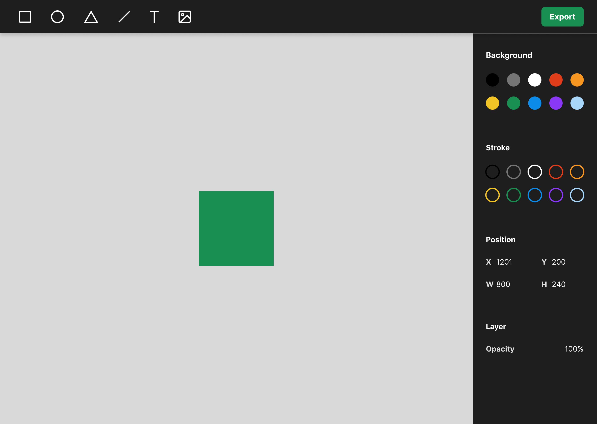

# Figma Clone Challenge (Hard) <!-- omit in toc -->

- [Introduction](#introduction)
- [Problem Statement](#problem-statement)
- [Requirements](#requirements)
- [Expectations](#expectations)
- [Evaluation](#evaluation)
- [Setup](#setup)

## Introduction

Hey **Challenger** 🤝 ...

Apparently you have a great appetite for our challenges. or maybe you are a **10x engineer** 😎💻?.

Let us introduce our selfs, we are **WTM Algiers LLC** a digital firm based in Algiers, Bay Area.

Founded in 2001 we are one of the world's leading innovators and manufacturers of creative video editing technology.

## Problem Statement

If you have been following up with the tech news lately you might have heard that **Adobe** has acquired the design tool that we all love [**Figma**](https://news.adobe.com/news/news-details/2022/Adobe-to-Acquire-Figma/default.aspx).

And as you know with each acquisition, there is a chance for a new tool to emerge and gain a share of the market.

We have been thinking of creating a new fully open source design tool, that could be the future alternative to **Figma**.

But we need your help with building an early prototype as a proof of concept, with only the basic functionality. This will help us better sell our idea to our investors & collaborators.

### Features

We want for our prototype to be an MVP, and to include the following features:

- Supports drawing basic shapes (rectangles, ellipses, lines)
- Supports writing text.
- Supports changing elements colors.

### Bonus Features

- Supports dragging and moving objects in the draw area.
- Supports basic embeds (images).
- Supports custom text properties (size, font, color).

### Wireframe



## Requirements

1. Solution must work in a browser.
2. Solution must use the provided starter code.
3. Solution must use the **FabricJS** library.

## Expectations

- This challenge should take around **3** to **4** hours to complete.
- We value a **clean**, **simple** working solution.
- We expect a working prototype in major browsers.

## Evaluation

This challenge has maximum points of **15** for implementing all the required features. plus a set of bonus points that will be granted if you implement bonus features, for each bonus feature you will earn **3pts**.

## Setup

To get you started with this challenge, we have provided you with a starter code. so you need first to copy to your local environment the `starter` folder you see next to this challenge. and install all the dependencies:

```bash
cd starter-folder
npm install
npm run dev
```

**[⬆ back to top](#introduction)**
