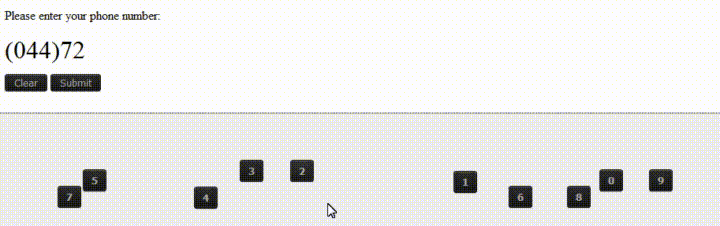

# Phone Input Challenge (Medium)

- [Introduction](#introduction)
- [Problem Statement](#problem-statement)
- [Requirements](#requirements)
- [Expectations](#expectations)
- [Notes](#notes)

## Introduction

Phone numbers are a very common type of data, that's heavily collected by websites, be it through a simple registration form, or a full account verification process, you are likely to be asked for a phone number on each website you visit.

Given how commonly-entered phone numbers are, companies have invested a big amount of time in perfecting the best UX/UI for an phone number input.

## Problem Statement

HTML input element of type `tel` is widely used to let the user enter or edit a phone number. but unlike inputs of type `email` or `url`, the `tel` input type has no built-in browser support for format validation (aka: masks), due to the nature of phone numbers varying from country to country.

Your task today as our hero designer is to implement a fully functioning phone number input that takes into account all the formats that we want to support, while also providing our users with the visual feedback when the input value is not valid.

## Requirements

- The phone input must allow the user to choose the flag of the country.
- Upon choosing the country flag, the input must update accordingly to validate for that country format.
- We must support 4 country validation masks :
  - Algeria
  - Germany
  - Uruguay
  - The united states
- The solution needs to be implemented only using HTML, CSS and JS.
- The use of external libraries is prohibited.

## Expectations

- We expect a working phone input that matches the provided mockup and specs.

## Notes

- You can find the SVGs for the required countries' flags in the `resources` folder.
- The implementation of more countries is a bonus (+2pts).

**[⬆ back to top](#introduction)**
